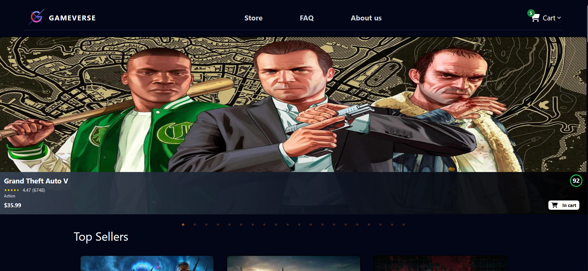
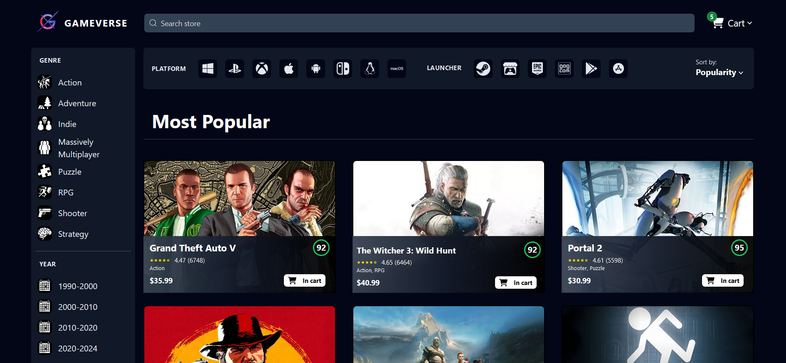
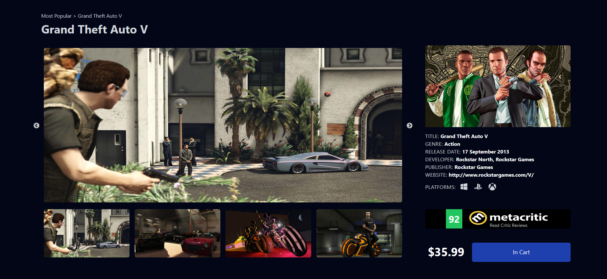
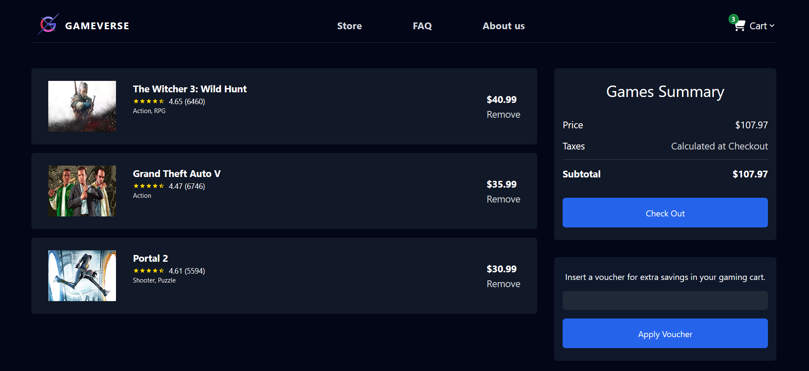

# Welcome to GameVerse 🎮
GameVerse is a personal project I created to explore game store functionalities, utilizing React, Tailwind CSS, React Router, React Slick and integrating with the RAWG Video Games Database API. It provides a platform for browsing and shopping for games, featuring a home page, store, game page, and shopping cart.
### LIVE: https://gameverse-six.vercel.app/
## Features
-  **Home Page**: Explore trending, top-rated, top-sellers, top-upcoming and recently updated games.
- 	**Store**: Browse through a wide range of games and apply filters to find the perfect match.
- 	**Game Page**: View detailed information about individual games, including descriptions, ratings, and screenshots.
- 	**Shopping Cart**: Keep track of selected games and proceed to checkout seamlessly.
- 	**Filters and Sorting**: Easily find games by applying filters based on genres, release years, minimum ratings, platforms, and launchers. Sort games by popularity, release date, or alphabetical order.
- 	**Search Bar**: Search among over 800,000 games to quickly find your favorites or discover new titles.
- 	**Responsive Design**: Enjoy a seamless browsing experience across various devices, including desktops, tablets, and smartphones.
- 	**Detailed Game Information**: Access comprehensive details about each game, including descriptions, ratings, genres, release dates, platforms, and screenshots.
- 	**Persistent Data**: Utilize local storage to preserve cart items and user preferences across sessions, ensuring a seamless browsing experience.
## Screenshots

